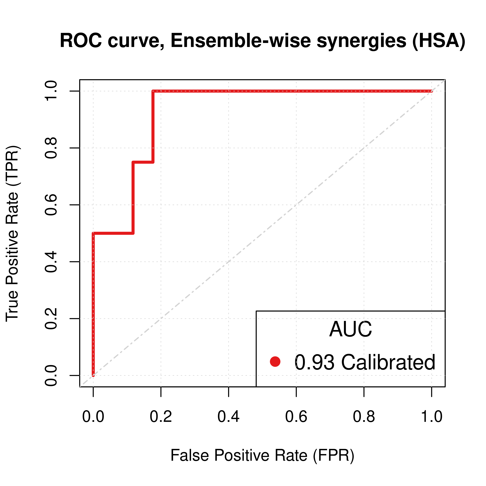
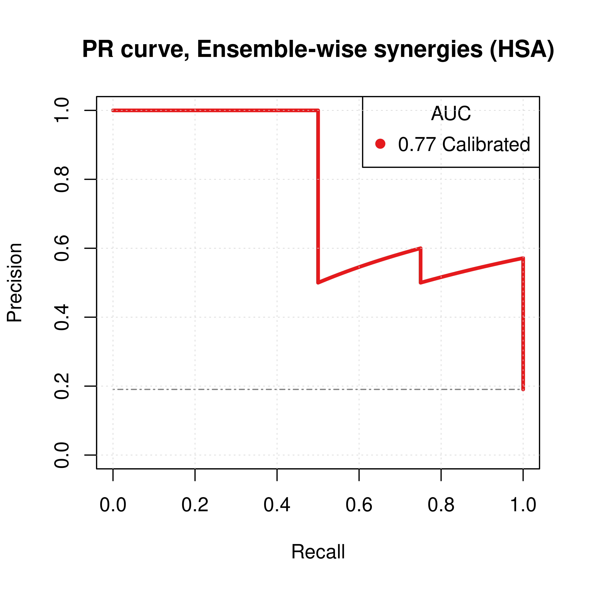

# Intro {-}

The purpose of the present tutorial is to provide guidance for the installation, execution, visualization and interpretation of output simulation results for the DrugLogics software pipeline module [druglogics-synergy](https://github.com/druglogics/druglogics-synergy).

The `druglogics-synergy` module runs sequentially two software modules.
Firstly, [gitsbe](https://github.com/druglogics/gitsbe) is used to create an ensemble of Boolean models fit to a specific steady state or perturbation data using a genetic parameterization algorithm.
Then [drabme](https://github.com/druglogics/drabme) uses the output models from gitsbe to perform a drug response analysis of a given drug panel and produces predicted synergy scores for each respective drug combination.

You can find the full documentation for these two modules in the following link: https://druglogics.github.io/druglogics-doc/.

# Install {-}

:::{.green-box}
Firstly, make sure you have installed [Maven](https://maven.apache.org/install.html) `3.6.0` and `Java 8` (minimum working versions).
For the rest of the tutorial we are going to use the `druglogics-synergy` at version `1.2.1`, which includes `gitsbe` at `1.3.1` version and `drabme` at `1.2.1` version.
:::

There are **two ways** to install `druglogics-synergy`.

1. **The easiest option** is to download the latest released package from GitHub: https://github.com/druglogics/druglogics-synergy/packages/.
The file of interest is `synergy-1.2.1-jar-with-dependencies.jar`, which includes all dependencies and does not require any manual installation whatsoever.

2. **The other option** is to clone the repositories ^[Due to GitHub's security policies, not allowing users to download a public package without a PAT (Personal Access Token) as of November 2021, you have to install each dependency repository (gitsbe, drabme) separately.] and install them manually using Maven:

```
git clone https://github.com/druglogics/gitsbe.git
cd gitsbe
git checkout v1.3.1
mvn clean install
cd ../

git clone https://github.com/druglogics/drabme.git
cd drabme
git checkout v1.2.1
mvn clean install
cd ../

git clone https://github.com/druglogics/druglogics-synergy
cd druglogics-synergy
git checkout v1.2.1
mvn clean install
```

After executing the above commands, the `synergy-1.2.1-jar-with-dependencies.jar` file will be created inside the `druglogics-synergy/target` directory.

:::{.note}
Even if you choose the 1st option, make sure you clone the `druglogics-synergy` repo and put the `synergy-1.2.1-jar-with-dependencies.jar` file inside the `druglogics-synergy/target` directory (as `mvn clean install` command does) to be inline with the next instructions in this tutorial.
:::

# Run CASCADE 1.0 Example {-}

We are going to use the [`ags_cascade_1.0`](https://github.com/druglogics/druglogics-synergy/tree/v1.2.1/ags_cascade_1.0) directory that resides in the `druglogics-synergy` directory as an input to the `Launcher` class to run the CASCADE 1.0 example.

The command to execute from the root of the `druglogics-synergy` directory is the following:

```
java -cp target/synergy-1.2.1-jar-with-dependencies.jar eu.druglogics.synergy.Launcher --inputDir=ags_cascade_1.0
```

The above command should create a new directory inside `ags_cascade_1.0` that includes the output result files.
Given that the simulations use all available cores, it shouldn't take more than **30sec to 1min** to complete the execution on a modern computer.

:::{.note}
For the rest of this tutorial we are going to use the output results produced from the execution of the above command, please refer to [this directory](https://github.com/druglogics/synergy-tutorial/tree/main/ags_cascade_1.0_20211121_150114).
:::

## Inputs {-}

A brief description of the input files included in the [`ags_cascade_1.0`](https://github.com/druglogics/druglogics-synergy/tree/v1.2.1/ags_cascade_1.0) directory follows:

1. [`network.sif`](https://github.com/druglogics/druglogics-synergy/tree/v1.2.1/ags_cascade_1.0/network.sif): a single-interactions network file in Cytoscape's .sif tab-delimited format.
This file defines the CASCADE 1.0 topology.
2. [`training`](https://github.com/druglogics/druglogics-synergy/tree/v1.2.1/ags_cascade_1.0/training): this file has the training data for gitsbe's algorithm in one of the formats specified in the respective [documentation](https://druglogics.github.io/druglogics-doc/training-data.html).
Here, we train to an unperturbed condition, with a steady state observation response as curated from many publications for the AGS cell line [@Flobak2015].
3. [`modeloutputs`](https://github.com/druglogics/druglogics-synergy/tree/v1.2.1/ags_cascade_1.0/modeloutputs): this is a file that is used to calculate the output growth response of a Boolean model after its attractors are computed.
See more information in the respective [documentation](https://druglogics.github.io/druglogics-doc/modeloutputs.html).
Here, we define 3 nodes that signal cell proliferation when active (`RSK_f`, `MYC` and `TCF7_f`) and 3 that signal apoptosis (`CASP8`, `CASP9` and `FOXO_f`).
4. [`drugpanel`](https://github.com/druglogics/druglogics-synergy/tree/v1.2.1/ags_cascade_1.0/drugpanel): this file has the drugs and their respective targets, which are going to be analyzed by drabme using gitsbe's output Boolean models.
More info can be found [here](https://druglogics.github.io/druglogics-doc/drug-panel.html).
5. [`config`](https://github.com/druglogics/druglogics-synergy/tree/v1.2.1/ags_cascade_1.0/config): configuration file that defines several parameters used by gitsbe and drabme.
Apart from the short description for each parameter provided in the `config` file, there is a more complete documentation of each option [available here](https://druglogics.github.io/druglogics-doc/gitsbe-config.html).
    - The most important options for [gitsbe](https://github.com/druglogics/druglogics-synergy/blob/v1.2.1/ags_cascade_1.0/config#L27) are the tool used to calculate the models' attractors (bioLQM, see [@Naldi2018]), **the number of simulations** $(50)$, number of generations per simulation ($20$), number of models per generation $(20)$, **number of best-fit models to save** after each simulation is finished $(3)$ and the type of [model mutations](https://druglogics.github.io/druglogics-doc/gitsbe-config.html#mutation-types) used (here we use *balance* or *link operator* mutations).
    - For [drabme](https://github.com/druglogics/druglogics-synergy/blob/v1.2.1/ags_cascade_1.0/config#L96), the two most important configuration parameters are the maximum drug set size to test ($2$, i.e. up to drug pairs) and the method used for the calculation of drug synergies (we use HSA [@gaddum1940pharmacology] in the `config` file, but also Bliss [@Bliss1939] is available).

## Outputs {-}

The most significant outputs in the [results directory](https://github.com/druglogics/synergy-tutorial/tree/main/ags_cascade_1.0_20211121_150114) are:

- **Gitsbe-specific**:
    - A [`models`](https://github.com/druglogics/synergy-tutorial/tree/main/ags_cascade_1.0_20211121_150114/models) directory with files in `.gitsbe` format ^[You can configure gitsbe to export the resulting Boolean models to more standard formats, see the respective [option here](https://github.com/druglogics/druglogics-synergy/blob/v1.2.1/ags_cascade_1.0/config#L88)], representing the best-fit boolean models out of the simulations of the genetic algorithm.
    Here, since we configured to have $50$ simulations and save the best $3$ models out of each simulation, we end up with a total of $150$ models after gitsbe finishes its execution.
- **Drabme-specific**:
  - A [`ensemble-wise synergies file`](https://github.com/druglogics/synergy-tutorial/blob/main/ags_cascade_1.0_20211121_150114/ags_cascade_1.0_ensemblewise_synergies.tab), providing the synergy predictions based on gitsbe's models.
  For every drug combination tested (we have $7$ drugs in the [drugpanel file](https://github.com/druglogics/druglogics-synergy/blob/v1.2.1/ags_cascade_1.0/drugpanel), so a total of ${7\choose2} = 21$ drug pairs are tested), drabme calculates a synergy score indicating how synergistic that combination was (more negative means more synergistic), based on the HSA synergy metric.

## How are predictions calculated? {-}

Let's look at an example: drabme [has calculated](https://github.com/druglogics/synergy-tutorial/blob/main/ags_cascade_1.0_20211121_150114/ags_cascade_1.0_ensemblewise_synergies.tab#L11) a synergy score equal to $\approx -0.943$ for the combination `PD-AK` (MEK and AKT inhibitor).

Drabme used gitsbe's $150$ output Boolean models and perturbed them first with the single drug `PD` (changing the equation of the respective target to equal $0$, i.e. `MEK_f = 0`).
Then it calculated all the models' attractors.
The ensemble of models that had at least one attractor were able to provide an [output response](https://druglogics.github.io/druglogics-doc/modeloutputs.html) each, from which drabme calculates the ensemble's average response to the `PD` drug.
Same procedure is followed for the `AK` drug: changing its target's equation appropriately (`AKT_f = 0`) in all $150$ models, calculating their attractors and using only the models that had at least one attractor to calculate the ensemble's average response to drug `PD`.
So we are left with two average single-drug response values, from which we choose as a *reference value* (according to the HSA model we used) **the more negative of the two** (as the values represent cell growth output).

Drabme repeats the previous process by now **changing both equations** in all $150$ models, computing their attractors and finding the ensemble's average growth output response for the `PD-AK` combination.
If this combination value is *lower than the reference value*, the difference is outputted in the ensemble synergies output file.
For our particular case, the difference of the combination's `PK-AD` average response to the minimum of the single-drug average responses in the $150$ model ensemble, is equal to $\approx -0.943$.
Since this value is the lowest in the output [ensemble-wise synergies file](https://github.com/druglogics/synergy-tutorial/blob/main/ags_cascade_1.0_20211121_150114/ags_cascade_1.0_ensemblewise_synergies.tab), `PK-AD` is the most synergistic drug combination out of our simulations.

# Visualize Prediction Performance {-}

**How good were drabme's synergy predictions?**

This is a standard binary classification problem (synergy or no synergy, varying a threshold defining how stringent is our definition of synergy) and to properly assess our algorithm's performance we need to compare our results with a true set of drug synergies.
All $21$ drug combinations from the [drugpanel file](https://github.com/druglogics/druglogics-synergy/blob/v1.2.1/ags_cascade_1.0/drugpanel) were experimentally tested in [@Flobak2015], producing a set of $4$ gold standard synergies:

:::{.green-box}
`PI-PD`, `PI-5Z`, `PD-AK`, `AK-5Z`
:::

## Read Output Results {-}

Load the appropriate libraries:

```{.r .fold-show}
suppressMessages(library(dplyr))
library(tibble)
library(emba)
library(usefun)
library(PRROC)
library(DT)
```

Read the data using the `emba` library [@Zobolas2020]:

```{.r .fold-show}
# Read ensemble-wise synergies file
# `ss` => models trained to steady state
ss_hsa_file = "ags_cascade_1.0_20211121_150114/ags_cascade_1.0_ensemblewise_synergies.tab"
ss_hsa_ensemblewise_synergies = emba::get_synergy_scores(ss_hsa_file)

# Read observed synergies file
observed_synergies_file = 'observed_synergies_cascade_1.0'
observed_synergies = emba::get_observed_synergies(observed_synergies_file)
# 1 (positive/observed synergy) or 0 (negative/not observed) for all tested drug combinations
observed = sapply(ss_hsa_ensemblewise_synergies$perturbation %in% observed_synergies, as.integer)

# Make a data table
pred_hsa = dplyr::bind_cols(ss_hsa_ensemblewise_synergies %>% rename(ss_score = score),
  tibble::as_tibble_col(observed, column_name = "observed"))

# Visualize our prediction results in a table format
DT::datatable(data = pred_hsa, options = 
  list(pageLength = 7, lengthMenu = c(7, 14, 21), searching = FALSE)) %>% 
  DT::formatRound(columns = 2, digits = 3)
```

```{=html}
<div id="htmlwidget-5a83393f7577a70f7285" style="width:100%;height:auto;" class="datatables html-widget"></div>
<script type="application/json" data-for="htmlwidget-5a83393f7577a70f7285">{"x":{"filter":"none","vertical":false,"data":[["1","2","3","4","5","6","7","8","9","10","11","12","13","14","15","16","17","18","19","20","21"],["PI-PD","PI-CT","PI-BI","PI-PK","PI-AK","PI-5Z","PD-CT","PD-BI","PD-PK","PD-AK","PD-5Z","CT-BI","CT-PK","CT-AK","CT-5Z","BI-PK","BI-AK","BI-5Z","PK-AK","PK-5Z","AK-5Z"],[-0.633699633699634,0,-0.204448329448329,-0.224852862493312,-0.0333288172334372,-0.313618771165941,0,-0.325976107226107,0,-0.942822870851659,0,0,0,0,0,-0.564138576779026,-0.165625813166797,0,-0.518270229440091,0,-0.462540217557837],[1,0,0,0,0,1,0,0,0,1,0,0,0,0,0,0,0,0,0,0,1]],"container":"<table class=\"display\">\n  <thead>\n    <tr>\n      <th> <\/th>\n      <th>perturbation<\/th>\n      <th>ss_score<\/th>\n      <th>observed<\/th>\n    <\/tr>\n  <\/thead>\n<\/table>","options":{"pageLength":7,"lengthMenu":[7,14,21],"searching":false,"columnDefs":[{"targets":2,"render":"function(data, type, row, meta) {\n    return type !== 'display' ? data : DTWidget.formatRound(data, 3, 3, \",\", \".\");\n  }"},{"className":"dt-right","targets":[2,3]},{"orderable":false,"targets":0}],"order":[],"autoWidth":false,"orderClasses":false}},"evals":["options.columnDefs.0.render"],"jsHooks":[]}</script>
```

## Receiver Operating Characteristic (ROC) {-}

We use the `get_roc_stats()` function from the `usefun` R package [@R-usefun]:

```{.r .fold-show}
# Get ROC statistics (`res_ss_ew$AUC` holds the ROC AUC)
res_ss_ew = usefun::get_roc_stats(df = pred_hsa, pred_col = "ss_score", label_col = "observed")

# Plot ROC
my_palette = RColorBrewer::brewer.pal(n = 9, name = "Set1")

plot(x = res_ss_ew$roc_stats$FPR, y = res_ss_ew$roc_stats$TPR,
  type = 'l', lwd = 3, col = my_palette[1], main = 'ROC curve, Ensemble-wise synergies (HSA)',
  xlab = 'False Positive Rate (FPR)', ylab = 'True Positive Rate (TPR)')
legend('bottomright', title = 'AUC', col = my_palette[1:2], pch = 19,
  legend = paste(round(res_ss_ew$AUC, digits = 2), "Calibrated"), cex = 1.3)
grid(lwd = 0.5)
abline(a = 0, b = 1, col = 'lightgrey', lty = 'dotdash', lwd = 1.2)
```

<div class="figure" style="text-align: center">

<p class="caption">(\#fig:roc-res)ROC curve (CASCADE 1.0, HSA synergy method, 150 models calibrated to the AGS steady state)</p>
</div>

## Precision-Recall (PR) {-}

We use the `pr.curve()` function from the `PRROC` package [@Grau2015]:

```{.r .fold-show}
# NOTE: PRROC considers by default that larger prediction values indicate the 
# positive class labeling. For us, the synergy scores belonging to the positive 
# or synergy class (observed = 1) are the lower ones, so we need to
# reverse the scores to correctly calculate the PR curve
pr_ss_hsa = PRROC::pr.curve(scores.class0 = pred_hsa %>% pull(ss_score) %>% (function(x) {-x}), 
  weights.class0 = pred_hsa %>% pull(observed), curve = TRUE, rand.compute = TRUE)

plot(pr_ss_hsa, main = 'PR curve, Ensemble-wise synergies (HSA)', 
  auc.main = FALSE, color = my_palette[1], rand.plot = TRUE)
legend('topright', title = 'AUC', col = my_palette[1:2], pch = 19,
  legend = paste(round(pr_ss_hsa$auc.davis.goadrich, digits = 2), "Calibrated"))
grid(lwd = 0.5)
```

<div class="figure" style="text-align: center">

<p class="caption">(\#fig:pr-res)PR curve (CASCADE 1.0, HSA synergy method, 150 models calibrated to the AGS steady state)</p>
</div>

# Normalization {-}

# R session info {-}


```{.r .fold-show}
xfun::session_info()
```

```
R version 3.6.3 (2020-02-29)
Platform: x86_64-pc-linux-gnu (64-bit)
Running under: Ubuntu 20.04.3 LTS

Locale:
  LC_CTYPE=en_US.UTF-8       LC_NUMERIC=C              
  LC_TIME=en_US.UTF-8        LC_COLLATE=en_US.UTF-8    
  LC_MONETARY=en_US.UTF-8    LC_MESSAGES=en_US.UTF-8   
  LC_PAPER=en_US.UTF-8       LC_NAME=C                 
  LC_ADDRESS=C               LC_TELEPHONE=C            
  LC_MEASUREMENT=en_US.UTF-8 LC_IDENTIFICATION=C       

Package version:
  assertthat_0.2.1    base64enc_0.1.3     bit_4.0.4          
  bit64_4.0.5         bookdown_0.24       bslib_0.3.1        
  Ckmeans.1d.dp_4.3.3 cli_3.0.1           clipr_0.7.1        
  compiler_3.6.3      cpp11_0.4.0         crayon_1.4.1       
  crosstalk_1.1.1     DBI_1.1.1           digest_0.6.28      
  dplyr_1.0.7         DT_0.19             ellipsis_0.3.2     
  emba_0.1.8          evaluate_0.14       fansi_0.5.0        
  fastmap_1.1.0       fs_1.5.0            generics_0.1.0     
  glue_1.4.2          graphics_3.6.3      grDevices_3.6.3    
  grid_3.6.3          highr_0.9           hms_1.1.1          
  htmltools_0.5.2     htmlwidgets_1.5.4   igraph_1.2.6       
  jquerylib_0.1.4     jsonlite_1.7.2      knitr_1.36         
  later_1.3.0         lattice_0.20.45     lazyeval_0.2.2     
  lifecycle_1.0.1     magrittr_2.0.1      Matrix_1.3.4       
  methods_3.6.3       parallel_3.6.3      pillar_1.6.3       
  pkgconfig_2.0.3     prettyunits_1.1.1   progress_1.2.2     
  promises_1.2.0.1    PRROC_1.3.1         purrr_0.3.4        
  R6_2.5.1            rappdirs_0.3.3      rbibutils_2.2.3    
  RColorBrewer_1.1-2  Rcpp_1.0.7          Rdpack_2.1.2       
  readr_2.0.2         rje_1.10.16         rlang_0.4.11       
  rmarkdown_2.11      sass_0.4.0          stats_3.6.3        
  stringi_1.7.5       stringr_1.4.0       tibble_3.1.5       
  tidyr_1.1.4         tidyselect_1.1.1    tinytex_0.34       
  tools_3.6.3         tzdb_0.1.2          usefun_0.4.8       
  utf8_1.2.2          utils_3.6.3         vctrs_0.3.8        
  visNetwork_2.1.0    vroom_1.5.5         withr_2.4.2        
  xfun_0.26           yaml_2.2.1         
```

# References {-}
